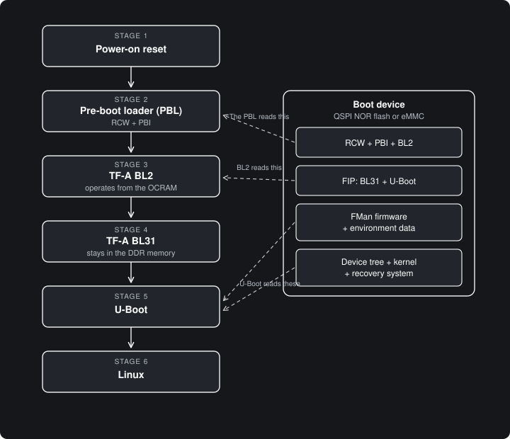

# Boot Process — General Description

This document gives a general description of the boot process of the Mono Gateway Development Kit.

The boot data is in one of 2 memory devices:
- The QSPI NOR flash. This is the recovery device.
- The eMMC device. This is the primary device.

The DIP switch on the board tells the processor which device will be used.

*The boot stages and the boot device*

| Stage | Name | Where it operates | Primary function |
|---|---|---|---|
| 1 | Power-on reset | Hardware | Find the boot device |
| 2 | Pre-boot loader (PBL) | Hardware | Configure the processor and load BL2 |
| 3 | TF-A BL2 | Internal RAM (OCRAM) | Start the DDR memory and load the images |
| 4 | TF-A BL31 | DDR memory | Supply runtime services |
| 5 | U-Boot | DDR memory | Prepare the hardware and find Linux |
| 6 | Linux | DDR memory | Operate the system |

## Stage 1 — Power-on reset

When the power comes on, the reset logic of the processor starts the boot sequence.
The processor reads the boot switch, which shows the location of the boot data: the QSPI NOR flash or the eMMC device.
At this time, the processor cores do not operate and the DDR memory is not available.

## Stage 2 — The pre-boot loader (PBL)

The PBL is a hardware (not software) function of the processor. The PBL reads the reset configuration word (RCW) from the boot device.
The RCW is a small block of data, that typically sets the clock speeds, the SerDes configuration, and the pin functions of the processor.

Then the PBL executes the pre-boot initialization (PBI) commands. The PBI commands are located after the RCW on the boot device.
The PBI commands correct small faults in the hardware (hardware errata) and copy the stage 2 boot loader (BL2) into the internal RAM (OCRAM).
The OCRAM has a capacity of 128 KB (2x 64KB - there are 2 OCRAMs) so BL2 must be small.

*OCRAM does not need any complex initialization process, unlike DDR RAM.*

When the PBL is complete, the first processor core starts. The core gets the start address of BL2 and gives control to BL2. The 3 other cores stay in a hold condition until stage 6 (Operating System).

## Stage 3 — TF-A BL2

BL2 is the first software stage. It is a part of the Trusted Firmware-A (TF-A).
BL2 operates from the OCRAM and starts the serial console, initializes the DDR memory, ...

When the DDR memory is up and running, BL2 reads the FIP image that contains BL31 (another part of TF-A) and U-Boot from the boot device. Then it copies BL31 and U-Boot into the DDR memor and finally, gives the control to BL31.

*The Mono Gateway Development Kit has 8 GB of DDR4 memory with error correction.*

## Stage 4 — TF-A BL31

BL31 is the runtime firmware. It stays in a protected part of the DDR memory while the system operates and supplies the power control services (PSCI) to U-Boot and to Linux. These services start and stop the processor cores, do a system reset, ... BL31 then gives control to U-Boot (at a lower privilege level).

## Stage 5 — U-Boot

U-Boot is the boot loader. It loads the firmware, reads its environment data, runs the hardware tests, ...

It then boots OpenWRT from one of two **A/B rootfs slots**. U-Boot picks the active slot (`slot` a or b, which sets `bootpart`/`rootpart`) and runs that slot's `extlinux` boot script (`sysboot mmc 0:${bootpart} … /boot/extlinux/extlinux.conf`) to load the kernel and device tree. If a slot fails to boot `bootlimit` times it switches to the other slot automatically (`altbootcmd`); if neither boots, it falls back to the recovery system in the firmware region of the selected boot medium.

*The environment data contains the boot instructions.*
*The two slots let an update install into the inactive slot and roll back on its own if the new system fails to boot.*
*The recovery system is a full Linux system with the necessary repair tools.*

## Stage 6 — Linux

The Linux kernel starts and gets control of the system and reads the hardware description from the device tree file.
The kernel then starts the 3 other processor cores, starts the network interfaces and the other devices, starts the user programs, ...

**The boot process is complete.**

## Resources / Additional reading
[LS1046A Reference Manual](https://www.nxp.com/webapp/Download?colCode=LS1046ARM) *You need an NXP account... Yay!*
- Chapter 4: Reset, Clocking, and Initialization (Specifically: 4.4.1 Power-on reset sequence)
- Chapter 26: Pre-Boot Loader (PBL)

[Our QSPI RCW](https://github.com/we-are-mono/rcw/blob/mono-development/gateway_dk/NN_FFSSPSNP_1133_5A06/rcw_2100_qspiboot.rcw)

[Our eMMC RCW](https://github.com/we-are-mono/rcw/blob/mono-development/gateway_dk/NN_FFSSPSNP_1133_5A06/rcw_2100_emmcboot.rcw)

[Our firmware image](https://github.com/we-are-mono/meta-mono/blob/master/recipes-core/images/firmware-image.bb#L83-L88)

[ARM privilege and exception levels](https://support.arm.com/documentation/102412/0103/Privilege-and-Exception-levels)
