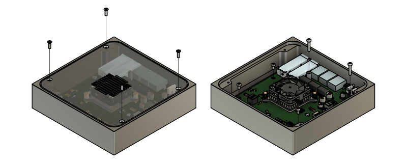
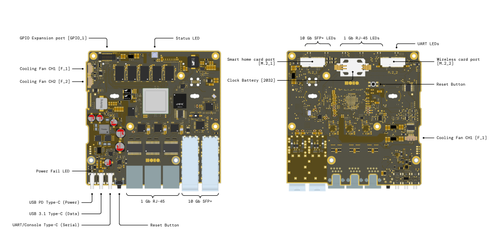

# Getting started

The Development Kit was designed with expandability in mind. This page describes the functionality of the expansion ports and how to use them.

## Disassembly instructions
Since the expansion features are not accessible with the enclosure installed, it is mandatory to remove the printed circuit board (PCB) from the enclosure.

Before disassembling the device, ensure that proper ESD safety precautions are followed to prevent damage to the electronics.

### Required tools

Torx T10 screwdriver

### Instructions

### Steps

- Power off the device and disconnect all cables.

- Place the device on a clean, flat, and ESD-safe surface.

- Using a Torx T10 screwdriver, remove the four screws securing the top cover of the enclosure.

- Carefully lift and remove the top cover.

- Using the same Torx T10 screwdriver, remove the five screws that secure the PCB to the enclosure.

- Gently lift the PCB out of the enclosure, holding it by the edges only.

### ESD safety notes

- Work on an ESD-safe surface whenever possible.

- Wear a grounded ESD wrist strap, or regularly touch a grounded metal object to discharge static electricity.

- Avoid touching components, connectors, or exposed contacts on the PCB.

- Store the PCB in an ESD-safe bag when it is not installed in the enclosure.  

## Port description

