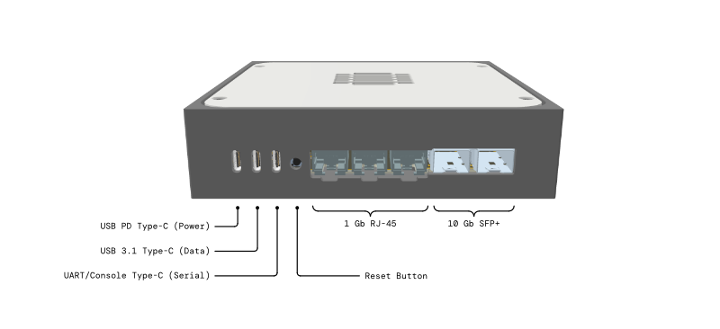

# Getting started

Before plugging the Development Kit in for the first time, it's worth familiarizing yourself with both: the ports on the back of the device as well as the First boot procedure.

## Connectors



More detailed information about the ports is provided in [Hardware description](hardware-description.md)


## First boot

1. Connect the power cable and the UART cable to your computer.
2. Open a serial terminal:
   ```
   tio /dev/ttyUSB0
   ```
   (Adjust the device path if needed—check `ls /dev/ttyUSB*` to find yours.)
3. You should now see output from the device.

Press the reset button to observe the full boot sequence. The device will boot through U-Boot, which displays a countdown before loading the OS. You can either:

- **Let it continue** — boots into OpenWRT on the eMMC.
- **Press any key** — interrupts the countdown and drops you into the U-Boot shell.

### Recovery Linux

To explore the firmware or troubleshoot issues, enter the following in U-Boot:

```
=> run recovery
```

This boots a minimal Linux environment from NOR flash. While its primary purpose is recovering a broken main OS, it's also useful for low-level system maintenance and learning how the components work.

The default user is `root` with no password.

To exit Recovery Linux and boot into OpenWRT:

```
$ reboot
```


It seems we introduced a bug in building the final OpenWRT image, resulting in the device not having the LuCI (web gui) installed. In order to fix that, you'll need to reflash the eMMC drive on the board, but worry not, it only takes a couple of minutes!

With UART connected, reset the device, interrupt the u-boot countdown, then run these commands:
```
=> run recovery
# When you get to Recovery linux, enter "root", no password needed
$ ip link set eth0 up; ip addr add 10.0.0.199/24 dev eth0; ip route add default via 10.0.0.1 dev eth0
# eth0 is the leftmost RJ-45 port, recovery linux has no DHCP, so you have to set ip and router address manually
$ curl -kO https://mono.si/openwrt-layerscape-armv8_64b-mono_gateway-dk-ext4-rootfs.ext4.gz
$ gunzip openwrt-layerscape-armv8_64b-mono_gateway-dk-ext4-rootfs.ext4.gz
$ dd if=openwrt-layerscape-armv8_64b-mono_gateway-dk-ext4-rootfs.ext4 of=/dev/mmcblk0p1 bs=1M
$ reboot
```

Keep in mind: you should do this as soon as possible, because you will lose all configuration. Or make a backup if you already configured the router.

If you need help, drop by our [Discord](https://discord.gg/FGHJ3J5v5W) and we'll help you sort this out!


### Status LED

During boot, U-Boot runs a series of hardware tests to verify that all I2C devices are present and functioning correctly. This includes power sensors, thermal sensors, the fan controller, power delivery controller, EEPROM, and more.

| LED Color       | Meaning                          |
|-----------------|----------------------------------|
| Green (solid)   | All hardware tests passed        |
| Red (solid)     | One or more tests failed         |
| Orange (pulsing)| Booted into Recovery Linux       |
| White (solid)   | Booted into OpenWRT              |

If the LED turns red, reset the device and check the U-Boot output via the serial console—it will report which chip failed its test.

## Next steps

**Using OpenWRT (default)**

The Development Kit ships with OpenWRT pre-installed. To start using it, simply connect a client device to one of the RJ-45 ports, navigate to `192.168.1.1` in your browser, and use LuCI to configure the device.

**Installing an alternative OS**

If you'd prefer to run Debian or Mono SDK Linux instead, see [Alternative operating systems](alternative-os.md).
