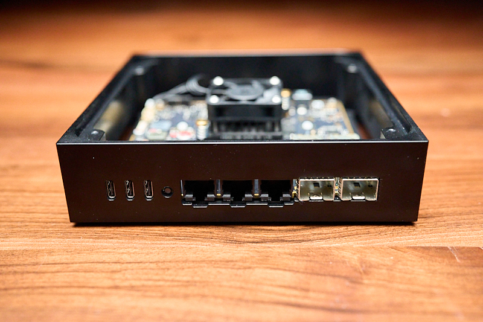

# Getting started

Before plugging the Development Kit in for the first time, it's worth familiarizing yourself with both: the ports on the back of the device as well as the First boot procedure.

## Connectors



User interface from left to right:

**USB PD Type-C (Power)**
Use the included 65W GaN power supply. Alternatively, any USB PD 3.0 compliant PSU rated for 15V 3A (45W) or 20V 2A (40W) or more will work. If the board doesn't power up with a third-party adapter, it likely failed to negotiate sufficient power - this is indicated by the Power Fail LED diode.  

***Power Fail LED:***  
Turned ON: Insufficient external USB power supply  
Turned OFF: External power supply meets the required power needs

**USB 3.1 Type-C (Data)**
A standard USB 3.1 host port. Use it to connect a thumb drive for backups, transfer files to/from the device, or attach external storage. Data speed 5Gbps. This port is designed to power and external device with 5V, up to 3A (15W).

**UART/Console Type-C (Serial)**
Your primary interface for communicating with the device, especially during initial setup. Connect this to your computer's USB 2.0 port and use a serial terminal at 115200 baud. We recommend [tio](https://github.com/tio/tio) on macOS/Linux or PuTTY on Windows.

**Reset Button**
Resets the device by pulling the reset pin to ground on most chips. Note that this performs a reset, not a full power cycle.

**1 Gb RJ-45**
Standard gigabit Ethernet ports, compatible with typical home networking equipment.

**10 Gb SFP+**
High-speed 10 gigabit ports for fiber or DAC connections. These should be compatible with a wide array of modules. If a particular module doesn't work, it's usually not a hardware limitation—the retimer chip is fully configurable via I2C, and our [kernel configuration is open source](https://github.com/we-are-mono/meta-mono/blob/master/meta-mono-bsp/recipes-kernel/linux/files/defconfig).

## First boot

1. Connect the power cable and the UART cable to your computer.
2. Open a serial terminal:
   ```
   tio /dev/ttyUSB0
   ```
   (Adjust the device path if needed—check `ls /dev/ttyUSB*` to find yours.)
3. You should now see output from the device.

Press the reset button to observe the full boot sequence. The device will boot through U-Boot, which displays a countdown before loading the OS. You can either:

- **Let it continue** — boots into OpenWRT on the eMMC.
- **Press any key** — interrupts the countdown and drops you into the U-Boot shell.

### Recovery Linux

To explore the firmware or troubleshoot issues, enter the following in U-Boot:

```
=> run recovery
```

This boots a minimal Linux environment from NOR flash. While its primary purpose is recovering a broken main OS, it's also useful for low-level system maintenance and learning how the components work.

The default user is `root` with no password.

To exit Recovery Linux and boot into OpenWRT:

```
$ reboot
```

### Status LED

During boot, U-Boot runs a series of hardware tests to verify that all I2C devices are present and functioning correctly. This includes power sensors, thermal sensors, the fan controller, power delivery controller, EEPROM, and more.

| LED Color       | Meaning                          |
|-----------------|----------------------------------|
| Green (solid)   | All hardware tests passed        |
| Red (solid)     | One or more tests failed         |
| Orange (pulsing)| Booted into Recovery Linux       |
| White (solid)   | Booted into OpenWRT              |

If the LED turns red, reset the device and check the U-Boot output via the serial console—it will report which chip failed its test.

## Next steps

**Using OpenWRT (default)**

The Development Kit ships with OpenWRT pre-installed. To start using it, simply connect a client device to one of the RJ-45 ports, navigate to `192.168.1.1` in your browser, and use LuCI to configure the device.

**Installing an alternative OS**

If you'd prefer to run Debian or Mono SDK Linux instead, see [Alternative operating systems](alternative-os.md).
