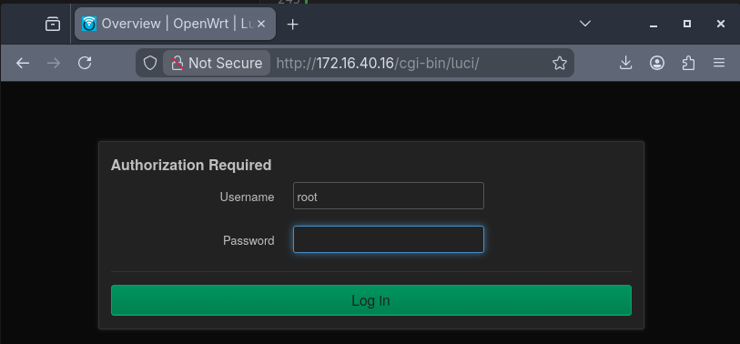

# Getting started

Before plugging the Development Kit in for the first time, it's worth familiarizing yourself with both: the ports on the back of the device as well as the First boot procedure.

## Connectors


More detailed information about the ports is provided in [Hardware description](hardware-description.md)

| Port (left to right) | Name               |
|----------------------|----------------------------------|
| 0                    | USB-c power                      |
| 1                    | USB-c                            |
| 2                    | USB-c UART                       |
| 3                    | eth0                             |
| 4                    | eth1                             |
| 5                    | eth2                             |
| 6                    | eth3 10GE                        |
| 7                    | eth4 10GE                        |


## First boot

1. Connect the power cable and the UART cable to your computer. ( Power is left most, UART is right most. )
2. Open a serial terminal:
   ```
   tio /dev/ttyUSB0
   ```
   (Adjust the device path if needed—check `ls /dev/ttyUSB*` to find yours.)
3. You should now see output from the device.

Press the reset button to observe the full boot sequence. The device will boot through U-Boot, which displays a countdown before loading the OS. You can either:

- **Let it continue** — boots into OpenWRT on the eMMC.
- **Press any key** — interrupts the countdown and drops you into the U-Boot shell.

When attaching the USB cable to the router's UART, in dmesg you will see something like:
```
[  292.530676] usb 7-2: new full-speed USB device number 2 using xhci_hcd
[  292.682522] usb 7-2: New USB device found, idVendor=0403, idProduct=6015, bcdDevice=10.00
[  292.682529] usb 7-2: New USB device strings: Mfr=1, Product=2, SerialNumber=3
[  292.682532] usb 7-2: Product: FT230X Basic UART
[  292.682534] usb 7-2: Manufacturer: FTDI
[  292.682536] usb 7-2: SerialNumber: DK0JTX4I
[  292.710533] usbcore: registered new interface driver ftdi_sio
[  292.710557] usbserial: USB Serial support registered for FTDI USB Serial Device
[  292.710742] ftdi_sio 7-2:1.0: FTDI USB Serial Device converter detected
[  292.710783] usb 7-2: Detected FT-X
[  292.720684] usb 7-2: FTDI USB Serial Device converter now attached to ttyUSB0
```

### Recovery Linux

To explore the firmware or troubleshoot issues, enter the following in U-Boot:

```
=> run recovery
```

This boots a minimal Linux environment from NOR flash. While its primary purpose is recovering a broken main OS, it's also useful for low-level system maintenance and learning how the components work.

The default user is `root` with no password.

To exit Recovery Linux and boot into OpenWRT:

```
$ reboot
```


It seems we introduced a bug in building the final OpenWRT image, resulting in the device not having the LuCI (web gui) installed. In order to fix that, you'll need to reflash the eMMC drive on the board, but worry not, it only takes a couple of minutes!

With UART connected, reset the device, interrupt the u-boot countdown, then run these commands:
```
=> run recovery
# When you get to Recovery linux, enter "root", no password needed
$ ip link set eth0 up; ip addr add 10.0.0.199/24 dev eth0; ip route add default via 10.0.0.1 dev eth0
# eth0 is the leftmost RJ-45 port, recovery linux has no DHCP, so you have to set ip and router address manually
$ curl -kO https://mono.si/openwrt-layerscape-armv8_64b-mono_gateway-dk-ext4-rootfs.ext4.gz
$ gunzip openwrt-layerscape-armv8_64b-mono_gateway-dk-ext4-rootfs.ext4.gz
$ dd if=openwrt-layerscape-armv8_64b-mono_gateway-dk-ext4-rootfs.ext4 of=/dev/mmcblk0p1 bs=1M
$ reboot
```

Keep in mind: you should do this as soon as possible, because you will lose all configuration. Or make a backup if you already configured the router.

If you need help, drop by our [Discord](https://discord.gg/FGHJ3J5v5W) and we'll help you sort this out!


### Status LED

During boot, U-Boot runs a series of hardware tests to verify that all I2C devices are present and functioning correctly. This includes power sensors, thermal sensors, the fan controller, power delivery controller, EEPROM, and more.

| LED Color       | Meaning                          |
|-----------------|----------------------------------|
| Green (solid)   | All hardware tests passed        |
| Red (solid)     | One or more tests failed         |
| Orange (pulsing)| Booted into Recovery Linux       |
| White (solid)   | Booted into OpenWRT              |

If the LED turns red, reset the device and check the U-Boot output via the serial console—it will report which chip failed its test.

## Next steps

**Using OpenWRT (default)**

The Development Kit ships with OpenWRT pre-installed. To start using it, simply connect a client device to one of the RJ-45 ports, navigate to `192.168.1.1` in your browser, and use LuCI to configure the device.

### Installing OpenWRT packages

The default install has the following apk repositories, which allows you to add new repos to the customfeeds.list ( or distfeeds.list, not sure it makes any difference ).
```
root@OpenWrt:~# cat /etc/apk/repositories.d/
customfeeds.list  distfeeds.list
root@OpenWrt:~# cat /etc/apk/repositories.d/distfeeds.list
https://downloads.openwrt.org/releases/25.12.0-rc3/targets/layerscape/armv8_64b/packages/packages.adb
https://downloads.openwrt.org/releases/25.12.0-rc3/packages/aarch64_generic/base/packages.adb
root@OpenWrt:~# cat /etc/apk/repositories.d/customfeeds.list
# add your custom package feeds here
#
# http://www.example.com/path/to/files/packages.adb
root@OpenWrt:~#
```

To add the standard packages/pacakages, verify, and update
```
echo "https://downloads.openwrt.org/releases/25.12.0-rc3/packages/aarch64_generic/packages/packages.adb" >> /etc/apk/repositories.d/customfeeds.list

root@OpenWrt:~# cat /etc/apk/repositories.d/customfeeds.list
# add your custom package feeds here
#
# http://www.example.com/path/to/files/packages.adb
https://downloads.openwrt.org/releases/25.12.0-rc3/packages/aarch64_generic/packages/packages.adb
root@OpenWrt:~#

root@OpenWrt:~# apk update
 [https://downloads.openwrt.org/releases/25.12.0-rc3/packages/aarch64_generic/packages/packages.adb]
 [https://downloads.openwrt.org/releases/25.12.0-rc3/targets/layerscape/armv8_64b/packages/packages.adb]
 [https://downloads.openwrt.org/releases/25.12.0-rc3/packages/aarch64_generic/base/packages.adb]
OK: 5601 distinct packages available

root@OpenWrt:~# apk search luci
luci-app-openthread-2025.06.12~2f3c799c-r1
nginx-mod-luci-1.26.3-r3
uwsgi-luci-support-2.0.30-r1
root@OpenWrt:~#
```

To add the LuCI web interface packages:
```
echo "https://downloads.openwrt.org/releases/25.12.0-rc3/packages/aarch64_generic/luci/packages.adb" >> /etc/apk/repositories.d/customfeeds.list

root@OpenWrt:~# apk update

root@OpenWrt:~# apk search luci | wc -l
3365
root@OpenWrt:~#
```

Wow.  That's a lot of packages

Now install luci
```
root@OpenWrt:~# apk add luci
( 1/32) Installing rpcd (2025.12.03~ffb9961c-r1)
  Executing rpcd-2025.12.03~ffb9961c-r1.post-install
( 2/32) Installing rpcd-mod-rpcsys (2025.12.03~ffb9961c-r1)
  Executing rpcd-mod-rpcsys-2025.12.03~ffb9961c-r1.post-install
( 3/32) Installing attendedsysupgrade-common (9)
  Executing attendedsysupgrade-common-9.post-install
( 4/32) Installing cgi-io (2025.12.11~658b14bd-r1)
  Executing cgi-io-2025.12.11~658b14bd-r1.post-install
( 5/32) Installing liblucihttp0 (2023.03.15~9b5b683f-r1)
  Executing liblucihttp0-2023.03.15~9b5b683f-r1.post-install
( 6/32) Installing liblucihttp-ucode (2023.03.15~9b5b683f-r1)
  Executing liblucihttp-ucode-2023.03.15~9b5b683f-r1.post-install
( 7/32) Installing rpcd-mod-file (2025.12.03~ffb9961c-r1)
  Executing rpcd-mod-file-2025.12.03~ffb9961c-r1.post-install
( 8/32) Installing rpcd-mod-luci (20240305-r1)
  Executing rpcd-mod-luci-20240305-r1.post-install
( 9/32) Installing rpcd-mod-ucode (2025.12.03~ffb9961c-r1)
  Executing rpcd-mod-ucode-2025.12.03~ffb9961c-r1.post-install
(10/32) Installing ucode-mod-html (1)
  Executing ucode-mod-html-1.post-install
(11/32) Installing ucode-mod-log (2026.01.16~85922056-r1)
  Executing ucode-mod-log-2026.01.16~85922056-r1.post-install
(12/32) Installing ucode-mod-math (2026.01.16~85922056-r1)
  Executing ucode-mod-math-2026.01.16~85922056-r1.post-install
(13/32) Installing luci-base (26.036.55399~eae876f)
  Executing luci-base-26.036.55399~eae876f.post-install
(14/32) Installing luci-app-attendedsysupgrade (26.036.55399~eae876f)
  Executing luci-app-attendedsysupgrade-26.036.55399~eae876f.post-install
(15/32) Installing luci-app-package-manager (26.036.55399~eae876f)
  Executing luci-app-package-manager-26.036.55399~eae876f.post-install
(16/32) Installing luci-app-firewall (26.036.55399~eae876f)
  Executing luci-app-firewall-26.036.55399~eae876f.post-install
(17/32) Installing luci-lib-uqr (26.036.55399~eae876f)
  Executing luci-lib-uqr-26.036.55399~eae876f.post-install
(18/32) Installing libiwinfo-data (2026.01.14~f5dd57a8-r1)
  Executing libiwinfo-data-2026.01.14~f5dd57a8-r1.post-install
(19/32) Installing libiwinfo20230701 (2026.01.14~f5dd57a8-r1)
  Executing libiwinfo20230701-2026.01.14~f5dd57a8-r1.post-install
(20/32) Installing rpcd-mod-iwinfo (2025.12.03~ffb9961c-r1)
  Executing rpcd-mod-iwinfo-2025.12.03~ffb9961c-r1.post-install
(21/32) Installing luci-mod-network (26.036.55399~eae876f)
  Executing luci-mod-network-26.036.55399~eae876f.post-install
(22/32) Installing luci-mod-status (26.036.55399~eae876f)
  Executing luci-mod-status-26.036.55399~eae876f.post-install
(23/32) Installing luci-mod-system (26.036.55399~eae876f)
  Executing luci-mod-system-26.036.55399~eae876f.post-install
(24/32) Installing luci-mod-admin-full (26.036.55399~eae876f)
  Executing luci-mod-admin-full-26.036.55399~eae876f.post-install
(25/32) Installing luci-proto-ipv6 (26.036.55399~eae876f)
  Executing luci-proto-ipv6-26.036.55399~eae876f.post-install
(26/32) Installing luci-proto-ppp (26.036.55399~eae876f)
  Executing luci-proto-ppp-26.036.55399~eae876f.post-install
(27/32) Installing luci-theme-bootstrap (26.036.55399~eae876f)
  Executing luci-theme-bootstrap-26.036.55399~eae876f.post-install
  * /luci-static/bootstrap
(28/32) Installing rpcd-mod-rrdns (20170710)
  Executing rpcd-mod-rrdns-20170710.post-install
(29/32) Installing uhttpd (2025.10.03~ebb92e6b-r1)
  Executing uhttpd-2025.10.03~ebb92e6b-r1.post-install
  * 4+0 records in
  * 4+0 records out
(30/32) Installing uhttpd-mod-ubus (2025.10.03~ebb92e6b-r1)
  Executing uhttpd-mod-ubus-2025.10.03~ebb92e6b-r1.post-install
  * 4+0 records in
  * 4+0 records out
(31/32) Installing luci-light (26.036.55399~eae876f)
  Executing luci-light-26.036.55399~eae876f.post-install
(32/32) Installing luci (26.036.55399~eae876f)
  Executing luci-26.036.55399~eae876f.post-install
OK: 59.3 MiB in 243 packages
root@OpenWrt:~#
```

Finally, start uhttpd
```
root@OpenWrt:~# /etc/init.d/uhttpd enable
root@OpenWrt:~# /etc/init.d/uhttpd start
4+0 records in
4+0 records out

root@OpenWrt:~# ps | grep http
11251 root      1912 S    /usr/sbin/uhttpd -f -h /www -r OpenWrt -x /cgi-bin -
11456 root      1328 R    grep http
root@OpenWrt:~#

root@OpenWrt:~# netstat -an | grep ":80"
tcp        0      0 0.0.0.0:80              0.0.0.0:*               LISTEN
tcp        0      0 :::80                   :::*                    LISTEN
root@OpenWrt:~#

```

In most cases, this should be enough to now connect to the web interface.  In my case, I need to add a firewall rule to allow traffic from another subnet.
```
root@OpenWrt:~# uci add firewall rule
icfg0e92bd
rewall.@rroot@OpenWrt:~# uci set firewall.@rule[-1].name='Allow-LuCI-from-Other-Subnet'
troot@OpenWrt:~# uci set firewall.@rule[-1].src='lan'
iroot@OpenWrt:~# uci set firewall.@rule[-1].src_ip='172.16.50.0/24'
froot@OpenWrt:~# uci set firewall.@rule[-1].dest_port='80 443'
 root@OpenWrt:~# uci set firewall.@rule[-1].proto='tcp'
froot@OpenWrt:~# uci set firewall.@rule[-1].target='ACCEPT'
 root@OpenWrt:~#
root@OpenWrt:~# # 2. Commit the changes
root@OpenWrt:~# uci commit firewall
root@OpenWrt:~# # 3. Restart the firewall to apply nftables rules
root@OpenWrt:~# /etc/init.d/firewall restart
root@OpenWrt:~#
```

Browsing to the IP of your router with http should now work.



**Installing an alternative OS**

If you'd prefer to run Debian or Mono SDK Linux instead, see [Alternative operating systems](alternative-os.md).  This is coming soon.
