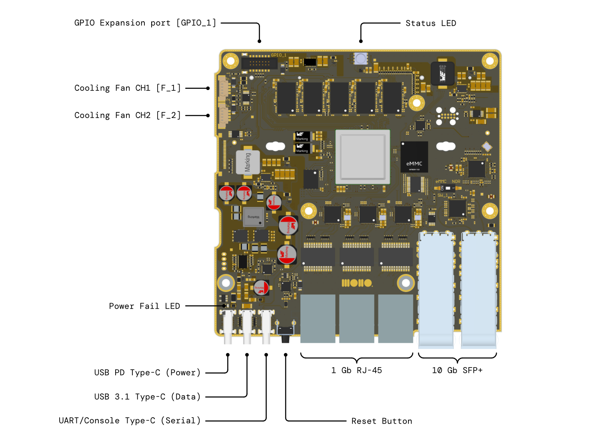
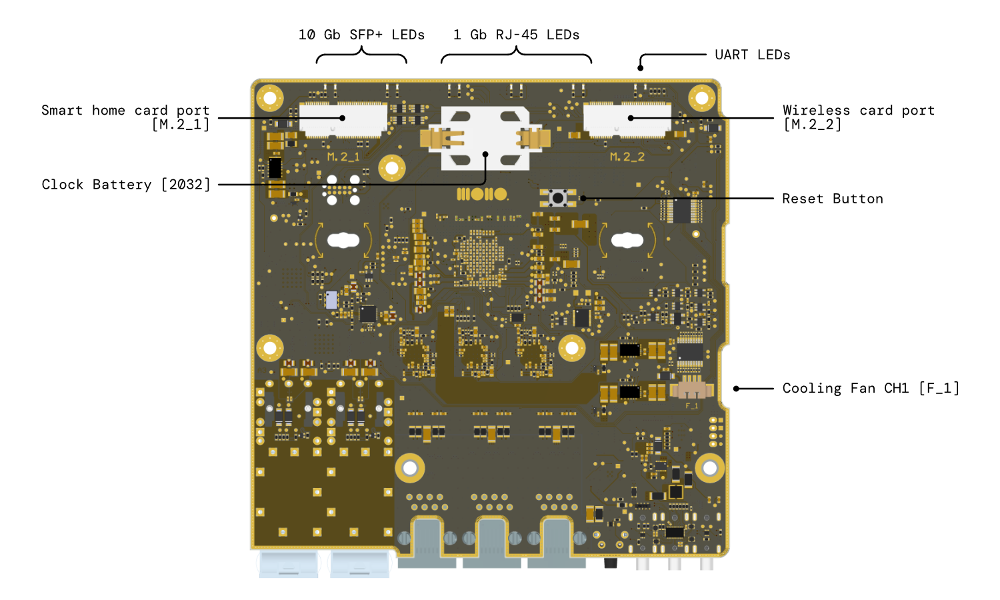
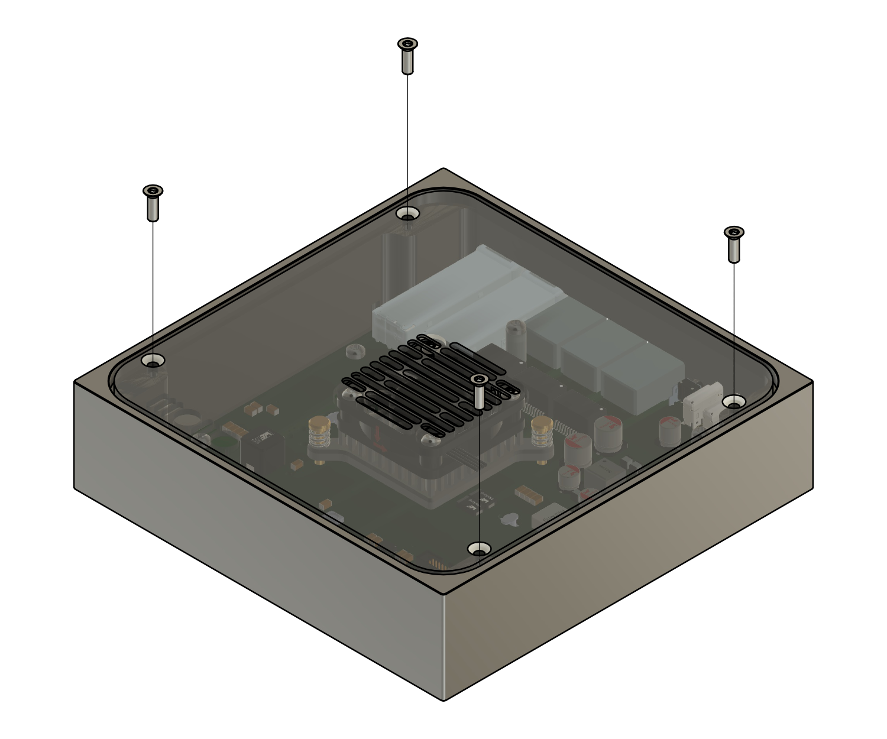
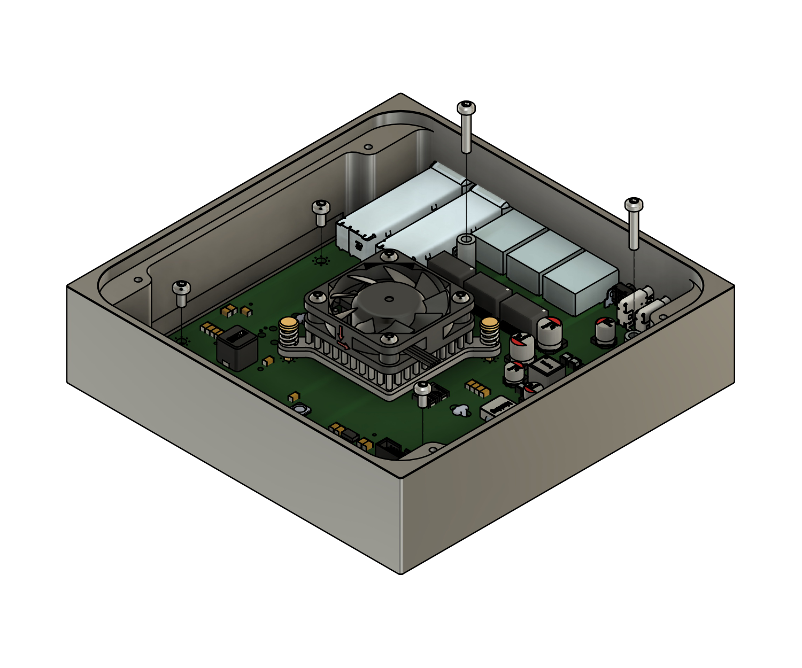
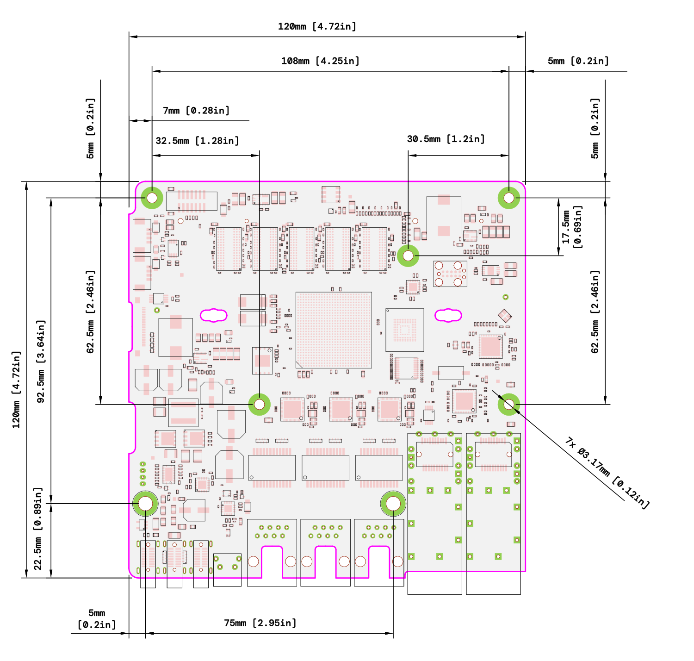

# Development Kit Hardware

This page describes the hardware specifications and functionality of the expansion ports and how to use them.

## Performance specification
|                            |                                                                                               |
|----------------------------|-----------------------------------------------------------------------------------------------|
| CPU                        | NXP Layerscape LS1046A 4 cores 1.6 GHz                                                  |
| RAM                        | 8 GB 2100 MT/s ECC support                                                              |
| Networking                 | 2x SFP+ 10 Gb 3x RJ-45 1 Gb                                                                |
| Wifi                       | 1x M.2 Key-E port for Wifi 6.0 2x2 MU-MIMO 1x M.2 Key-E port for tri-radio (Wifi 5.0, Bluetooth, Thread)                         |
| Storage                    | 32 GB eMMC for Operating System 64 MB NOR flash for Bootloader                             |
| Debugging                  | JTAG connector 100+ test points throughout the PCB UART USB-C port Status RGB LED    |
| Required Power supply      | USB-C PD 3.0 15V 3A (45W) or 20V 2A (40W)                                               |
| Connectivity               | 1x USB-C 3.1 port 5Gbps data speed 5V 3A output power                                   |
| Active cooling support     | Yes 2x 4-pin PWM 5V fan headers                                                            |

## Port description

### USB PD Type-C (Power)
Use the included 65W GaN power supply. Alternatively, any USB PD 3.0 compliant PSU rated for 15V 3A (45W) or 20V 2A (40W) or more will work. If the board doesn't power up with a third-party adapter, it likely failed to negotiate sufficient power - this is indicated by the Power Fail LED diode.  

### Power Fail LED
Turned ON: Insufficient external USB power supply  
Turned OFF: External power supply meets the required power needs. It is normal for the Power Fail LED to momentarily turn ON during the power up process. 

### USB 3.1 Type-C (Data)
A standard USB 3.1 host port. Use it to connect a thumb drive for backups, transfer files to/from the device, or attach external storage. Data speed 5Gbps. This port is designed to power an external device with 5V, up to 3A (15W).

### UART/Console Type-C (Serial)
Your primary interface for communicating with the device, especially during initial setup. Connect this to your computer's USB 2.0 port and use a serial terminal at 115200 baud. We recommend [tio](https://github.com/tio/tio) on macOS/Linux or PuTTY on Windows.

### Reset Button
Resets the device by pulling the reset pin to ground on most chips. Note that this performs a reset, not a full power cycle. There are two reset buttons on the PCB, one located near the USB and network ports and the second one is located on the bottom side of the board near the RTC coin backup battery.  

### 1 Gb RJ-45
Standard gigabit Ethernet ports, compatible with typical home networking equipment.

### 10 Gb SFP+
High-speed 10 gigabit ports for fiber or DAC connections. These should be compatible with a wide array of modules. If a particular module doesn't work, it's usually not a hardware limitation—the retimer chip is fully configurable via I2C, and our [kernel configuration is open source](https://github.com/we-are-mono/meta-mono/blob/master/meta-mono-bsp/recipes-kernel/linux/files/defconfig).

### Cooling Fan ports [F_1] & [F_2]

The cooling fan driver provides two fully independent channels designed to support 4-wire, 5 V cooling fans. These channels are labeled [F_1] and [F_2]. Channel 1 (CH1) has two physical connectors, one on the top side and one on the bottom side of the PCB, both labeled [F_1]. 


**WARNING** Only one cooling fan may be connected to CH1 at a time. Connecting more than one fan to this channel may result in malfunction or permanent damage to the cooling fan driver.


![Cooling Fan CH1 [F_1] & CH2 [F_2] pinout - PCB top side](assets/development-kit-gpio-port-fan-4-wire-653104124022-pinout.png)

![Cooling Fan CH1 [F_1] pinout - PCB bottom side](assets/development-kit-gpio-port-fan-4-wire-653104131822-pinout.png)

#### Connector type
| Connector type     | Description                  | Link                                                   |
|--------------------|------------------------------|--------------------------------------------------------|
| PCB connector [F_1]      | Wurth Elektronik 653104131822, 4-pin, 1.25mm  | [Datasheet](assets/653104131822.pdf)   |
| PCB connector [F_1] & [F_2]    | Wurth Elektronik 653104124022, 4-pin, 1.25mm  | [Datasheet](assets/653104124022.pdf)   |
| Wire connector    | Wurth Elektronik 620004113322, 4-pin, 1.25mm  | [Datasheet](assets/620004113322.pdf)   |

#### Pinout 
*From the PCB ports perspective*
| Pin #   | Name      | Specification                                  |
|---------|-----------|------------------------------------------------|
| 1       | GND       | Power ground                                   |
| 2       | +5V VCC   | Power output, 5V, 250mA max per port.          |
| 3       | TACH      | RPM feedback input Sometimes marked as "FG" |
| 4       | PWM       | PWM output signal                              |

### GPIO Expansion port [GPIO_1] 
The GPIO header can be found on the top side of the board and has 1.27mm pin pitch. 

#### Connector type
| Connector type     | Description                  | Link                                                   |
|--------------------|------------------------------|--------------------------------------------------------|
| PCB connector      | Wurth Elektronik 62701420621, 14-pin, 1.27mm  | [Datasheet](assets/62701420621.pdf)   |
| Cable connector    | Wurth Elektronik 62701423121, 14-pin, 1.27mm  | [Datasheet](assets/62701423121.pdf)   |

#### Pinout 
A GPIO pin configured as an output pin can be set to high (1.8V) or low (0V).  
A GPIO pin configured as an input pin can be read as high (1.8V) or low (0V). This is made easier with the use of internal pull-up or pull-down resistors. This can be configured in software.


**WARNING** GPIO data pins are not protected. Do not overstress them. Doing so will damage the CPU.


| Pin #      | Name                             | Specification                                      |
|------------|----------------------------------|----------------------------------------------------|
| 1          | PWR OUT 1.8V                     | Power output, 1.8V, 100mA max. Resettable fuse.    |
| 2          | PWR OUT 3.3V                     | Power output, 3.3V, 100mA max. Resettable fuse.    |
| 3          | I2C SDA                          | I2C BUS DATA. 1.8V logic level.                    |
| 5          | I2C SCL                          | I2C BUS CLOCK. 1.8V logic level.                   |
| 4          | GPIO_D1                          | GPIO pin #1                                        |
| 6          | GPIO_D2                          | GPIO pin #2                                        |
| 9          | GPIO_D3                          | GPIO pin #3                                        |
| 10         | GPIO_D4                          | GPIO pin #4                                        |
| 11         | GPIO_D5                          | GPIO pin #5                                        |
| 12         | GPIO_D6                          | GPIO pin #6                                        |
| 7-8, 13-14 | GND                              | Ground                                             |

#### Voltage specifications

| INPUT                     |                  |
|---------------------------|------------------|
| Absolute maximum rating   | 1.98 V           |
| Input high voltage        | >1.26 V          |
| Input low voltage         | <0.36 V          |
| Input current             | +-50 uA          |

| OUTPUT                    |                  |
|---------------------------|------------------|
| Output high voltage       | 1.35 V @ -0.5 mA |
| Output low voltage        | 0.4 V @ 0.5 mA   |
| Maximum current           | +-0.5 mA         |

### M2 wireless card ports [M2_1] & [M2_2]
The Gateway was designed to supports two types of wireless cards:

| Card type  | Features                                  | Key type | Purpose                      | PCB port designation |
|------------|-------------------------------------------|----------|------------------------------|----------------------|
| Tri-radio  | Wireless Bluetooth Threads 802.15.4 | Key-E    | Home automation & smarthome  | [M2_1]               |
| Dual-radio | Wireless Bluetooth                     | Key-E    | Main radio card for wireless | [M2_2]               |

#### Tri-radio wireless card [M2_1]
TBD

#### Dual-radio wireless card [M2_2]
The dual-radio expansion port [M2_2] was designed to support compatible M.2 Key-E wireless cards interfacing through the system’s supported buses (pinout table below). This allows the integration of various wireless cards that meet the electrical requirements of the platform.

##### Supported cards
The wireless expansion cards are partially tested and have not yet completed full validation. While core functionality has been verified, the design is still experimental.


**WARNING** Use of these cards is at your own risk. Performance, reliability, and long-term stability are not guaranteed, and changes may be made in future revisions.
 


**WARNING** It is strictly important to follow the M.2 pinout listed below when selecting and installing wireless cards. Not all M.2 Key-E cards are compatible with this board, and using an unsupported card or incorrect pinout may result in malfunction or hardware damage.
 

| Card name                                                                     | Test status                                                                 | Recommended to use   |
|-------------------------------------------------------------------------------|-----------------------------------------------------------------------------|----------------------|
| [uBlox M2-JODY-W377-00B](assets/M2_Dual-Radio_M2-JODY-W3_DataSheet.pdf)       | Basic HW & Firmware tests done Performance validation not yet performed  | YES                  |
| [AzureWave AW-XM458MA-PUR](assets/M2_Dual-Radio_AW-XM458MA-PUR_DataSheet.pdf) | No tests performed yet                                                      | ON YOUR OWN RISK     |

##### Pinout 
*From the PCB port's perspective*
| Pin #                                   | Signal name              | Description                                        |
|-----------------------------------------|--------------------------|----------------------------------------------------|
| 18                                      | VIO_CFG                  | Pulled to ground via 0R resistor                   |
| 22                                      | UART_RXD I (1V8L)        | UART bus. Wifi card TXD output signal              |
| 32                                      | UART_TXD O (1V8L)        | UART bus. Wifi card RXD input signal               |
| 34                                      | UART_CTS I (1V8L)        | UART bus. Wifi card RTS output signal              |
| 36                                      | UART_RTS O (1V8L)        | UART bus. Wifi card CTS input signal               |
| 35                                      | PCIe TX0+ O (1V8L)       | PCIe bus. Wifi card RX0+ input signal              |
| 37                                      | PCIe TX0- O (1V8L)       | PCIe bus. Wifi card RX0- input signal              |
| 41                                      | PCIe RX0+ I (1V8L)       | PCIe bus. Wifi card TX0+ output signal             |
| 43                                      | PCIe RX0- I (1V8L)       | PCIe bus. Wifi card TX0- output signal             |
| 47                                      | PCIe REFCLK+ O (1V8L)    | PCIe bus. Wifi card REFCLK+ input signal           |
| 49                                      | PCIe REFCLK- O (1V8L)    | PCIe bus. Wifi card REFCLK- input signal           |
| 52                                      | M2_2R_RESET O (3V3L)     | Wifi card reset signal                             |
| 54                                      | M2_2R_RESET O (3V3L)     | Wifi card reset signal                             |
| 56                                      | M2_2R_ENABLE O (3V3L)    | Wifi card power-down signal                        |
| 24-31                                   | M.2 Key E connector notch| Mechanical cutout in the M.2 card                  |
| 1, 7, 33, 39, 45, 51, 57, 63, 69, 75 | GND                      | Ground                                             |
| 1, 4, 72, 74                            | +3V3 VCC                 | Power output, 3.3V                                 |

#### Wireless card installation
TBD

### RTC backup battery
The Real-Time Clock (RTC) circuit uses a coin cell battery to maintain time and date information when the device is powered off or disconnected from the main power source.

If the battery is removed or fully discharged, the RTC will lose its stored time and date, and the clock will need to be reset after the next power-up.

| Battery spec                     |                                  |
|----------------------------------|----------------------------------|
| Model                            | CR2032                           |
| Size                             | 20mm diameter 3.2mm thickness |
| Nominal voltage / capacity       | 3V / >150mAh                     |
| Rechargable                      | No                               |

#### Replacing the battery

**WARNING** Do not use force to remove the battery from its holder.


To replace the battery, the PCB must first be removed from the enclosure. Follow the disassembly instructions provided below.

Once the PCB is accessible, use a flathead screwdriver to carefully lever the battery out of the holder, as shown in the image.

## Disassembly instructions
Since the expansion features are not accessible with the enclosure installed, it is mandatory to remove the printed circuit board (PCB) from the enclosure.

Before disassembling the device, ensure that proper ESD safety precautions are followed to prevent damage to the electronics.

### PCB removal guide
#### Required tools
Torx T10 screwdriver

#### Steps

- Power off the device and disconnect all cables.

- Place the device on a clean, flat, and ESD-safe surface.

- Using a Torx T10 screwdriver, remove the four screws securing the top cover of the enclosure.

- Carefully lift and remove the top cover.

- Using the same Torx T10 screwdriver, remove the five screws that secure the PCB to the enclosure.

- Gently lift the PCB out of the enclosure, holding it by the edges only.

#### ESD safety notes

- Work on an ESD-safe surface whenever possible.

- Wear a grounded ESD wrist strap, or regularly touch a grounded metal object to discharge static electricity.

- Avoid touching components, connectors, or exposed contacts on the PCB.

- Store the PCB in an ESD-safe bag when it is not installed in the enclosure.  

## PCB mechanical properties

PCB thickness is 1.6mm [63 mil]

## Development Kit enclosure
Here you can download the 3D step models of the Development Kit enclosure (top and bottom part).  

    Enclosure 3D step models.

